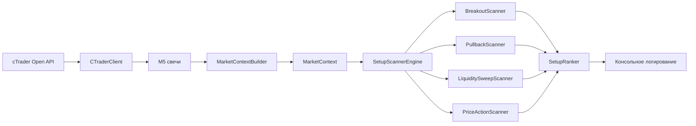

# Adaptive Dual Grid System

Read-only скринер рынка через **cTrader Open API**: мульти-сетап анализ (Breakout, Pullback, Liquidity Sweep, Price Action) на M5 с логированием в реальном времени.

Опционально: live-торговля (`SCREENER_ONLY=false`) и бэктest v3 (`python main.py --backtest`).

**Требования:** Python 3.10+

---

## Быстрый старт

```bash
python3 -m venv venv && source venv/bin/activate
pip install -r requirements.txt
cp .env.example .env
# заполнить CTRADER_*, ACCESS_TOKEN, ACCOUNT_ID (см. раздел «Конфигурация»)

SCREENER_ONLY=true python main.py
```

Для cTrader Open API нужны `CLIENT_ID`, `CLIENT_SECRET`, `ACCESS_TOKEN` и `ACCOUNT_ID` demo/live аккаунта ([Open API](https://openapi.ctrader.com/)).

Шаблон [.env.example](.env.example) настроен под screener (`SCREENER_ONLY=true`, `USE_MULTI_SCANNER=true`).

---

## Режимы

| Режим | Команда | Описание |
|-------|---------|----------|
| **Screener** (рекомендуется) | `SCREENER_ONLY=true python main.py` | Multi-setup анализ с логированием, без ордеров |
| Legacy screener | `SCREENER_ONLY=true USE_MULTI_SCANNER=false python main.py` | Только Breakout v3 + фазы FSM |
| **Trading Layer** | `STRATEGY_TYPE=DUAL_GRID_V8 python main.py` | Adaptive Dual Grid Portfolio Strategy v8 |
| Live | `SCREENER_ONLY=false python main.py` | Сигналы + `MANUAL` / `AUTO` |
| Backtest | `python main.py --backtest` | Прогон v3 по истории M5 с API |

В live-режиме `TRADING_MODE=MANUAL` только логирует сигналы; `AUTO` отправляет ордера через `TradeExecutor`. Торговое окно задаётся `TRADE_WINDOW_START` / `TRADE_WINDOW_END` (UTC).

---

## Dual Grid System (по умолчанию)

При `USE_MULTI_SCANNER=true` (default) screener запускает четыре сканера параллельно по каждой паре:

| Сканер | Тип сетапа | Логика (кратко) |
|--------|------------|-----------------|
| `BreakoutScanner` | `BREAKOUT` | Breakout Retest v3: пробой → displacement → shallow retest 30–70% |
| `PullbackScanner` | `PULLBACK` | EMA50/200 тренд + Fib 38.2–61.8% откат + свеча продолжения |
| `LiquiditySweepScanner` | `LIQUIDITY_SWEEP` | Кластер ликвидности → sweep → rejection-свеча |
| `PriceActionScanner` | `PRICE_ACTION` | Engulfing, Pin bar, Inside/Outside bar |

Pipeline:

```
Свечи → MarketContextBuilder → SetupScannerEngine → SetupRanker → Логирование
```

- **`MarketContext`** — frozen snapshot (ATR, тренд, S/R, swing points, liquidity zones) — вычисляется **один раз** на пару/бар
- **`SetupCandidate`** — унифицированный выход: entry, SL, TP, RR, score, reasons
- **`SetupRanker`** — нормализация балла 0–10 (см. таблицу ниже)
- **Логирование** — вывод лучших сетапов (max score) в консоль; дубликаты `SYMBOL` не выводятся

Breakout v3 логика **не изменена** — обёрнута в `BreakoutScanner` с иммутабельным FSM.

### Как считается SCORE (0–10)

| Фактор | Вес | Условие |
|--------|-----|---------|
| Тренд | +2.0 | Направление сетапа совпадает с EMA-трендом |
| Волатильность | +1.5 | Режим `NORMAL` или `HIGH` |
| Сессия | +1.0 | Бар в 12:00–17:00 UTC (London/NY overlap) |
| RR | +1.5 | RR ≥ 2.0 |
| Паттерн | +1.0 | `confidence` ≥ 0.8 |

Максимум **10.0** — все факторы выполнены. Score — **ранжирование качества контекста**, не winrate и не триггер ордера. В `SCREENER_ONLY` сделки не исполняются.

---

## Breakout Retest v3 (кратко)

На M5 стратегия ищет уровни поддержки/сопротивления, ждёт пробой с импульсом (displacement), затем shallow retest с откатом **30–70%** от импульса.

| Фаза FSM | Смысл |
|----------|-------|
| `IDLE` / `SCAN_LEVELS` | Поиск и кластеризация уровней |
| `BREAKOUT_DETECTED` / `DISPLACEMENT_WAIT` | Пробой уровня, ожидание импульса |
| `AWAITING_RETEST` / `WAIT_RETEST` | Импульс есть, ожидание shallow retest |
| `CONFIRMED` / `SETUP_READY` | Сетап сформирован |
| `INVALIDATED` / `SETUP_MISSED` | Таймаут или отмена сетапа |

Параметры: `app/config/settings.py` (`DEFAULT_PAIRS`, `_BREAKOUT_DEFAULTS`, `_BREAKOUT_OVERRIDES`). Переопределение в `.env`: `PAIRS=...` и `{PAIR}_BREAKOUT_*` (например, `EURUSD_BREAKOUT_MIN_DISPLACEMENT_PIPS=4.0`).

---

## Пары по умолчанию

9 инструментов: 7 мажоров G10 Forex + XAUUSD, BTCUSD.

`EURUSD`, `GBPUSD`, `USDJPY`, `USDCHF`, `AUDUSD`, `USDCAD`, `NZDUSD`, `XAUUSD`, `BTCUSD`

Дубликаты в `PAIRS` автоматически удаляются при загрузке конфига.

---

## Логирование

**Multi-setup** (`USE_MULTI_SCANNER=true`):

```
🎯 Найдено 3 кандидатов:
  - EURUSD: BREAKOUT | BUY
  - GBPUSD: LIQUIDITY_SWEEP | SELL
  - XAUUSD: PULLBACK | BUY
```

Показываются только пары с **активным сетапом** на текущем баре. Пар без сигнала в логах нет.

### Индикация SCORE

Score рассчитывается на основе факторов (см. таблицу ниже) и используется для ранжирования качества контекста.

**Legacy** (`USE_MULTI_SCANNER=false`) — все пары, фазы Breakout v3:

```
📊 [EURUSD] WAIT_RETEST: Ожидание shallow retest...
```

Обновление по закрытию M5-баров; переподключение к API при обрыве связи.

### API-метрики

API-метрики логируются с интервалом `API_METRICS_LOG_INTERVAL_SEC` (по умолчанию 300 с). Значение `0` отключает периодический лог.

| Поле | Смысл |
|------|-------|
| `hist` | Запросы исторических свечей (trendbars) |
| `non-hist` | Прочие API-запросы (auth, symbols и т.д.) |
| `chunks` | Чанки загрузки trendbars |
| `rate_limits` | Срабатывания rate limit |
| `backoff` | Текущая пауза backoff (сек) |
| `last_rl` | Время последнего rate limit |

---

## Нагрузка на API

- **Warmup cache** (`WARMUP_CACHE_ENABLED=true`) — при reconnect повторно не запрашивает уже загруженные свечи
- **Poll delay** (`PAIR_POLL_DELAY_SEC=0`) — auto-пауза между парами: 0.4 / 0.6 / 0.8 с в зависимости от числа пар
- **Chunk delays** в `CTraderClient` масштабируются по количеству пар

---

## Архитектура



**Screener (`SCREENER_ONLY=true`, `USE_MULTI_SCANNER=true`):**  
опрос M5 → `MultiSetupScreener.scan_all_pairs()` → логирование `SetupCandidate`.

**Legacy screener:** `BreakoutRetestV3Strategy` → `AnalysisResult` → `MarketRecommender` → логирование.

**Live (`SCREENER_ONLY=false`):** `StrategyOrchestrator` + `TradeGuard` + `MarketCache` + `TradeExecutor`.

**Backtest:** загрузка истории через API → `run_backtest_v3()`.

---

## Структура проекта

```
app/
  config/settings.py             # AppConfig, PairConfig, DEFAULT_PAIRS
  connection/
    ctrader_client.py            # TCP/TLS, protobuf, trendbars, quotes
    api_metrics.py               # счётчики API-запросов и rate limit
    warmup_cache.py              # кэш свечей при reconnect
    market_cache.py              # кэш котировок (live)
  scanner/                       # Dual Grid System
    screener_runtime.py          # MultiSetupScreener — wiring для main.py
    types/                       # MarketContext, SetupCandidate, enums
    context/                     # MarketContextBuilder, indicators
    protocols/                   # SetupScanner, AIExplanationService
    scanners/
      breakout/                  # BreakoutScanner (v3 FSM)
      pullback/                  # PullbackScanner
      liquidity_sweep/           # LiquiditySweepScanner
      price_action/              # PriceActionScanner
    ranking/ranker.py            # SetupRanker
    engine/setup_scanner_engine.py
    adapters/analysis_result.py  # legacy AnalysisResult → SetupCandidate
  core/recommender.py            # AnalysisResult (legacy screener)
  strategy/
    breakout_retest_v3.py        # логика v3 (live/backtest/legacy screener)
    fsm.py, orchestrator.py, backtest.py, trade_guard.py
  trading/                       # executor, stale_orders, position_sizer
  models/candle.py, signal.py
main.py
docs/prompt_screener.md
tests/
```

---

## Конфигурация (`.env`)

| Переменная | Назначение | По умолчанию в коде |
|------------|------------|---------------------|
| `CTRADER_HOST`, `CTRADER_PORT` | Endpoint API | `demo.ctraderapi.com:5035` |
| `CLIENT_ID`, `CLIENT_SECRET` | OAuth приложения | — |
| `ACCESS_TOKEN`, `ACCOUNT_ID` | Аккаунт | — |
| `PAIRS` | Список пар через запятую | 9 пар из `settings.py` |
| `SCREENER_ONLY` | Только анализ, без торговли | `false` |
| `USE_MULTI_SCANNER` | Multi-setup pipeline в screener | `true` |
| `WARMUP_CACHE_ENABLED` | Кэш свечей при reconnect | `true` |
| `PAIR_POLL_DELAY_SEC` | Пауза между парами (`0` = auto) | `0` |
| `API_METRICS_LOG_INTERVAL_SEC` | Интервал лога API-метрик (`0` = off) | `300` |
| `TRADING_MODE` | `MANUAL` / `AUTO` (live) | `MANUAL` |
| `TRADE_WINDOW_START`, `TRADE_WINDOW_END` | Окно анализа/торговли UTC | `08:00`–`16:00` |
| `MAX_LOT`, `TRAILING_STOP_LOSS` | Лимит лота, trailing SL | `1.0`, `true` |
| `PENDING_ORDER_MAX_AGE_SECONDS` | TTL pending-ордера | `300` |
| `STRATEGY_DEBUG_EVERY_N` | Лог FSM каждые N баров (`0` = авто) | `0` |
| `BACKTEST_BARS` | Свечей M5 на пару | `26000` |
| `BACKTEST_WARMUP_BARS` | Прогрев перед бэктestом | `500` |
| `BACKTEST_ASSUMED_SPREAD_PIPS` | Спред в бэктestе | `1.0` |

Полный шаблон: [.env.example](.env.example).

---

## Тесты

```bash
pip install -r requirements-test.txt
make test                              # unit-тесты (без integration)
make test-all                          # все тесты
make test-integration                  # demo API (маркер integration)
make test-coverage                     # coverage app/core, strategy, scanner

# Trading Layer тесты
pytest tests/test_trading_layer.py -v
pytest tests/test_trading_engine_integration.py -v -m integration
pytest tests/test_trading_layer.py::TestGridManager -v
pytest tests/test_trading_layer.py::TestPortfolioManager -v
pytest tests/test_trading_layer.py::TestTradingEngine -v
```

Основные модули: `test_scanner_phase2`, `test_scanner_phase3`, `test_setup_ranker`, `test_screener_runtime`, `test_api_load_helpers`, `test_breakout_retest_v3`, `test_orchestrator`, `test_guard`, `test_trading_layer` (48 unit-тестов), `test_trading_engine_integration` (demo smoke).

---

## Документация

- [docs/prompt_screener.md](docs/prompt_screener.md) — цели, архитектура и критерии скринера
- [docs/prompt_dual_grid_v8.md](docs/prompt_dual_grid_v8.md) — спецификация Trading Layer (Adaptive Dual Grid Portfolio Strategy v8)

---

## Trading Layer (Adaptive Dual Grid Portfolio Strategy v8)

Trading Layer реализует адаптивную стратегию двойной сетки поверх существующих Broker Layer и Scanner Layer.

### Основные возможности:

- **Независимые Long/Short сетки** - каждая сетка управляется отдельно с собственным шагом на основе ATR
- **Динамический шаг сетки** - `grid_step = ATR(14) * ATR_MULTIPLIER` с сглаживанием Уайлдера
- **Контроль экспозиции** - оценка маржи через `get_expected_margin()` для лимита суммарной позиции
- **Execution-проверки** - фильтрация по спреду и ATR-spike перед открытием позиций
- **Режимы деградации**:
  - **Normal** - обычный режим
  - **Conservative** - повышенный порог входа, сниженный объём
  - **Freeze** - новые уровни не открываются
  - **Exit** - закрытие худшей позиции
- **Глобальный TP/SL** - портфельный уровень прибыли/убытка
- **Дисбаланс-контроль** - ограничение перевеса одной стороны
- **TTL ордеров** - автоматическая отмена неисполненных грид-ордеров

### Конфигурация Trading Layer:

```bash
# Пороги входа и добавления уровней
ENTRY_THRESHOLD=0.7
ADD_LEVEL_THRESHOLD=0.6

# Параметры ATR
ATR_PERIOD=14
ATR_MULTIPLIER=1.5

# Лимиты сетки
MAX_GRID_LEVELS=5

# Управление рисками портфеля
MAX_PORTFOLIO_DRAWDOWN=-0.10
PORTFOLIO_TARGET=0.15
MAX_TOTAL_EXPOSURE=0.50
MAX_PAIR_EXPOSURE=0.30

# Размер позиции
RISK_PER_TRADE=0.02
SL_ATR_MULTIPLIER=2.0

# Execution-проверки
SPREAD_LOOKBACK_BARS=20
SPREAD_REJECT_MULTIPLIER=2.0
SPREAD_WARN_MULTIPLIER=1.5
ATR_BASELINE_LOOKBACK_BARS=50
ATR_SPIKE_MULTIPLIER=2.0
EXECUTION_WARN_VOLUME_REDUCTION=0.5

# Контроль дисбаланса
IMBALANCE_SOFT_THRESHOLD=0.6
IMBALANCE_HARD_THRESHOLD=0.8
IMBALANCE_SCORE_PENALTY=0.1

# Режимы деградации
EXIT_MODE_DRAWDOWN_THRESHOLD=-0.05
FREEZE_ATR_SPIKE_MULTIPLIER=3.0
FREEZE_CONSECUTIVE_REJECTIONS=5
CONSERVATIVE_SCORE_PENALTY=0.15
CONSERVATIVE_VOLUME_MULTIPLIER=0.7
CONSECUTIVE_REJECTIONS_FOR_CONSERVATIVE=3

# TTL ордеров
GRID_ORDER_TTL_BARS=3

# Наблюдаемые инструменты
WATCHED_INSTRUMENTS=EURUSD:M5
```

### Архитектура Trading Layer:

```
app/trading/
  grid_models.py          # GridPosition, Direction, ExecutionApproval
  grid_manager.py         # GridManager для Long/Short сеток одной пары
  grid_book.py            # GridBook — per-pair long + short grids
  portfolio_manager.py    # PortfolioManager для рисков и деградации
  atr_calculator.py       # Расчёт ATR методом Уайлдера
  trading_engine.py       # TradingEngine - основной оркестратор
```

**Multi-pair:** каждая пара из `WATCHED_INSTRUMENTS` получает собственную Dual Grid
(long + short). Дисбаланс и `MAX_PAIR_EXPOSURE` — per-pair; глобальный TP/SL и
`MAX_TOTAL_EXPOSURE` — на весь счёт. Глобальное закрытие (TP/SL/Exit) закрывает
позиции **всех** watched-пар.

Trading Layer интегрируется с существующим `StrategyOrchestrator` для отслеживания ордеров и recovery логики, но использует собственный `SetupScannerEngine` для получения сигналов.

---

## План разработки

### ✅ Предварительная задача: Расширение Broker Layer
Реализован метод `get_expected_margin()` в `CTraderClient` для оценки маржи через cTrader Open API (`ProtoOAExpectedMarginReq`/`ProtoOAExpectedMarginRes`).

### ✅ Основная задача: Trading Layer
Реализован Trading Layer (Adaptive Dual Grid Portfolio Strategy v8) поверх существующих Broker Layer и Scanner Layer:
- ✅ Независимые Long/Short сетки с динамическим шагом на основе ATR
- ✅ Контроль суммарной экспозиции через реальную оценку маржи у брокера
- ✅ Execution-проверки (спред/ATR-spike) перед открытием позиций
- ✅ Режимы деградации (Normal/Conservative/Freeze/Exit)
- ✅ Глобальный TP/SL и дисбаланс-контроль
- ✅ Интеграция с существующим `StrategyOrchestrator`
- ✅ Комплексные тесты (36 тестов)
