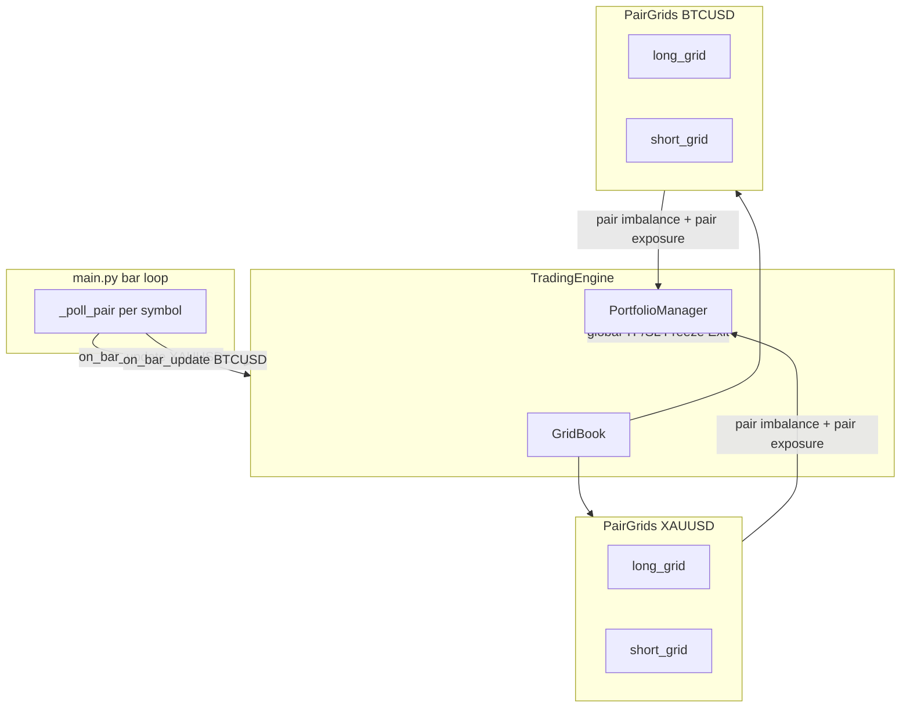

# План рефакторинга: Per-Pair Dual Grid

**Статус:** draft  
**Дата:** 2026-06-23  
**Контекст:** Trading Layer v8 сейчас использует **две глобальные сетки** (`long_grid` / `short_grid`) на весь счёт. При `PAIRS=XAUUSD,BTCUSD` это приводит к:

- дисбалансу 100% после одного LONG на XAUUSD → блокировка LONG на BTCUSD;
- некорректному add-level (`get_last_position()` берёт последнюю позицию **любой** пары);
- общему `MAX_GRID_LEVELS` и `level_index` на все инструменты;
- смешению exposure в «лотах» для инструментов с разным `lotSize`.

**Цель:** изолированный Dual Grid **на каждую торгуемую пару** + сохранение **портфельного** слоя риска (global TP/SL, Freeze/Exit, опциональный global exposure cap).

**Базовая спецификация:** `docs/prompt_dual_grid_v8.md` (требует обновления разделов 1, 4, 5, 7 после реализации).

---

## 1. Целевая архитектура

### 1.1 Сейчас vs цель

```
СЕЙЧАС                              ЦЕЛЬ
────────────────────────────────    ────────────────────────────────────
TradingEngine                       TradingEngine
  long_grid  ← все пары LONG          GridBook
  short_grid ← все пары SHORT             XAUUSD: long_grid + short_grid
  PortfolioManager (global)               BTCUSD: long_grid + short_grid
                                          PortfolioManager (global + per-pair checks)
```

### 1.2 Диаграмма потоков



### 1.3 Принцип разделения ответственности

| Слой | Scope | Решает |
|------|-------|--------|
| `PairGrids` | per-pair | уровни сетки, шаг ATR, TTL pending, add-level, **pair imbalance** |
| `PortfolioManager` | global | baseline equity, global TP/SL, Freeze/Exit, consecutive rejections, **global exposure cap** |
| `MultiSetupScreener` | per-pair | сигналы (без изменений) |
| `StrategyOrchestrator` | per-pair | tracking pending, recovery (без изменений) |

---

## 2. Решения по дизайну (зафиксировать до кода)

### 2.1 Дисбаланс — per-pair (обязательно)

```
pair_long  = pair_grids.long_grid.total_exposure_lots()
pair_short = pair_grids.short_grid.total_exposure_lots()
pair_total = pair_long + pair_short
pair_imbalance = |pair_long - pair_short| / pair_total   # если pair_total > 0
```

- `IMBALANCE_SOFT_THRESHOLD` / `IMBALANCE_HARD_THRESHOLD` применяются **внутри пары**.
- LONG на BTCUSD **не блокируется** из-за LONG-only exposure на XAUUSD.

### 2.2 Exposure — два уровня

| Уровень | Env | Формула |
|---------|-----|---------|
| **Per-pair** | `MAX_PAIR_EXPOSURE` (новый) | `(pair_long + pair_short + additional) * margin_per_lot[pair] <= equity * MAX_PAIR_EXPOSURE` |
| **Global** | `MAX_TOTAL_EXPOSURE` (существующий) | суммарная маржа всех позиций <= `equity * MAX_TOTAL_EXPOSURE` |

**ДОПУЩЕНИЕ (MVP global cap):** global exposure считается как сумма `lots * margin_per_lot[pair]` по всем позициям в `GridBook`.  
**Улучшение (фаза 6+):** использовать `usedMargin` из reconcile для точного global cap.

### 2.3 Global lifecycle — без изменений

- Global TP/SL, Freeze, Exit, `halted` — **портфельные** (как в v8).
- `_close_worst_position` — worst по `profit` среди **всех** позиций всех пар.
- `_close_all_positions` — закрывает **все** grids всех пар.

### 2.4 MAX_GRID_LEVELS — per-pair per-direction

- До 5 уровней LONG на XAUUSD **и** до 5 SHORT на XAUUSD **независимо**.
- То же для BTCUSD. Лимит **не** делится между парами.

### 2.5 Add-level — per-pair

```python
last_position = pair_grids.grid_for(direction).get_last_position()
distance = abs(current_price - last_position.entry_price)
distance >= last_position.grid_step_at_open
```

`get_last_position()` корректен, т.к. grid содержит только одну пару.

### 2.6 Поле `GridPosition.pair`

- Оставить для логов, bootstrap, reconcile (даже если grid scoped to pair).

### 2.7 WATCHED_INSTRUMENTS vs PAIRS

- `GridBook` инициализируется из **watched pairs** (уникальные символы из `WATCHED_INSTRUMENTS`).
- Если `PAIRS ⊃ WATCHED` — grids только для watched; остальные не торгуются (как сейчас).

---

## 3. Новые и изменённые модули

### 3.1 Новый файл: `app/trading/grid_book.py`

```python
@dataclass
class PairGrids:
    pair: str
    long_grid: GridManager
    short_grid: GridManager

    def grid_for(self, direction: Direction) -> GridManager: ...
    def is_active(self, direction: Direction) -> bool: ...
    def pair_exposure_lots(self) -> float: ...
    def pair_long_lots(self) -> float: ...
    def pair_short_lots(self) -> float: ...
    def clear_all(self) -> None: ...


class GridBook:
    def __init__(self, pairs: Iterable[str]) -> None: ...

    def get(self, pair: str) -> PairGrids: ...
    def pairs(self) -> list[str]: ...
    def iter_pair_grids(self) -> Iterator[PairGrids]: ...
    def iter_grids(self) -> Iterator[GridManager]: ...
    def find_position_by_client_order_id(self, cid: str) -> tuple[PairGrids, GridPosition] | None: ...
    def find_position_by_id(self, position_id: str) -> tuple[PairGrids, GridPosition] | None: ...
    def total_exposure_lots(self) -> float: ...
    def estimated_total_margin(self, margin_by_pair: dict[str, float]) -> float: ...
    def clear_all(self) -> None: ...
```

### 3.2 `app/trading/grid_manager.py`

Минимальные доработки (опционально):

- `get_last_position_for_pair(pair)` — **не нужен**, если grid scoped to one pair.
- `total_exposure_lots()` — без изменений.

### 3.3 `app/trading/portfolio_manager.py`

```python
def can_expand(
    self,
    pair: str,
    direction: Direction,
    pair_grids: PairGrids,
    grid_book: GridBook,
    equity: float,
    margin_per_lot: float,
    additional_lots: float,
    margin_by_pair: dict[str, float],
) -> bool: ...

def get_add_level_threshold_adjustment(self, pair_grids: PairGrids) -> float: ...
```

Порядок проверок в `can_expand`:

1. `halted` → False  
2. `margin_per_lot <= 0` → False  
3. **Pair imbalance hard** (только для `pair`)  
4. **Pair exposure** (`MAX_PAIR_EXPOSURE`)  
5. **Global exposure** (`MAX_TOTAL_EXPOSURE` через `grid_book.estimated_total_margin`)  
6. True  

### 3.4 `app/trading/trading_engine.py`

| Текущее | Целевое |
|---------|---------|
| `self.long_grid`, `self.short_grid` | `self.grids: GridBook` |
| `_grid_for_direction(dir)` | `_pair_grids(pair).grid_for(dir)` |
| `_has_pair_direction_level` | `pair_grids.is_active(direction)` |
| `_effective_add_threshold` | imbalance через `pair_grids` |
| `bootstrap_from_broker` | restore в `grids.get(pair)` |
| `_reconcile_positions(client, pair)` | только grids этой пары |
| `on_order_filled` | `grids.find_position_by_client_order_id` |
| lifecycle close methods | iterate `grids.iter_grids()` или `iter_pair_grids()` |

### 3.5 `app/config/settings.py` / `.env.example`

```bash
# Per-pair exposure cap (доля equity через margin 1 lot этой пары)
MAX_PAIR_EXPOSURE=0.25

# Global cap (существующий)
MAX_TOTAL_EXPOSURE=0.50
```

Defaults (рекомендация для 2 пар):

- `MAX_PAIR_EXPOSURE=0.30` — ~30% equity на одну пару  
- `MAX_TOTAL_EXPOSURE=0.50` — потолок на счёт  

### 3.6 Документация

- Обновить `docs/prompt_dual_grid_v8.md` (разделы 1, 4, 5, 7).  
- README: секция «Multi-pair Dual Grid».  
- `.cursorrules`: упомянуть `GridBook`.

---

## 4. Фазы реализации

### Фаза 0 — Спецификация (0.5 дня)

**Задачи:**

- [ ] Review и approve этого документа  
- [ ] Зафиксировать defaults для `MAX_PAIR_EXPOSURE`  
- [ ] Решить: global cap через lots×margin или usedMargin (MVP vs later)

**Критерий готовности:** согласованная таблица решений (раздел 2).

---

### Фаза 1 — GridBook + PairGrids (1 день)

**Задачи:**

- [ ] Создать `app/trading/grid_book.py`  
- [ ] Unit-тесты `tests/test_grid_book.py`:
  - lookup по pair  
  - `total_exposure_lots`  
  - `find_position_by_client_order_id`  
  - `clear_all`  

**Критерий готовности:** тесты green, TradingEngine **ещё не** переключён.

**PR-1:** только новый модуль + тесты.

---

### Фаза 2 — TradingEngine на GridBook (2–3 дня)

**Задачи:**

- [ ] Заменить `long_grid`/`short_grid` на `self.grids: GridBook`  
- [ ] Инициализация из watched pairs в `__init__`  
- [ ] Рефактор всех 15+ call sites (см. grep `long_grid|short_grid`)  
- [ ] `_can_add_level(pair_grids, ...)` — last position только внутри pair grid  
- [ ] `_place_grid_order` — `level_index = grid_manager.level_count() + 1` (per-pair)  
- [ ] `_effective_add_threshold(pair_grids, ...)`  
- [ ] `bootstrap_from_broker` → restore в правильный `PairGrids`  
- [ ] `on_order_filled` → `GridBook.find_*`  
- [ ] `restart()` → `grids.clear_all()`  

**Критерий готовности:**

- Demo smoke: `PAIRS=XAUUSD,BTCUSD` — XAU LONG + BTC SHORT на одном M5-цикле **без** portfolio imbalance block между парами.  
- Restart bootstrap восстанавливает обе пары в правильные grids.

**PR-2:** engine refactor + обновление существующих tests в `test_trading_layer.py`.

---

### Фаза 3 — PortfolioManager per-pair (1–2 дня)

**Задачи:**

- [ ] `can_expand(pair, pair_grids, grid_book, ...)` — pair imbalance + pair exposure + global cap  
- [ ] `get_add_level_threshold_adjustment(pair_grids)` — soft imbalance per-pair  
- [ ] Удалить передачу global `long_grid`/`short_grid` в portfolio  

**Критерий готовности:**

- Unit: XAU 100% long imbalance **не** блокирует BTC LONG.  
- Unit: XAU 100% long imbalance **блокирует** XAU LONG add.  
- Unit: pair exposure cap срабатывает до global cap.

**PR-3:** portfolio + tests.

---

### Фаза 4 — Config & env (0.5 дня)

**Задачи:**

- [ ] `MAX_PAIR_EXPOSURE` в `settings.py`  
- [ ] `.env.example` + README  
- [ ] Валидация: `MAX_PAIR_EXPOSURE <= MAX_TOTAL_EXPOSURE` (warning в лог при старте)

**PR-4:** config only (можно объединить с PR-3).

---

### Фаза 5 — Тесты (1–2 дня)

#### Unit matrix

| ID | Тест | Файл |
|----|------|------|
| T1 | GridBook lookup / exposure | `test_grid_book.py` |
| T2 | Per-pair add-level distance | `test_trading_layer.py` |
| T3 | Per-pair MAX_GRID_LEVELS independent | `test_trading_layer.py` |
| T4 | can_expand: cross-pair no block | `test_trading_layer.py` |
| T5 | can_expand: same-pair imbalance block | `test_trading_layer.py` |
| T6 | can_expand: MAX_PAIR_EXPOSURE | `test_trading_layer.py` |
| T7 | can_expand: MAX_TOTAL_EXPOSURE global | `test_trading_layer.py` |
| T8 | bootstrap restores to correct PairGrids | `test_trading_layer.py` |
| T9 | on_order_filled finds grid across pairs | `test_trading_layer.py` |
| T10 | reconcile per-pair, no duplicate | `test_trading_layer.py` |

#### Integration

| ID | Сценарий |
|----|----------|
| I1 | Demo dry-run: XAUUSD + BTCUSD simultaneous opposite directions |
| I2 | Restart with open XAU LONG + BTC SHORT → no duplicate orders |
| I3 | Add-level on XAU uses XAU last position (mock two pairs in grid) |

**Критерий:** `pytest tests/` green, integration smoke optional (requires credentials).

---

### Фаза 6 — Документация и spec sync (0.5 дня)

**Задачи:**

- [ ] Patch `docs/prompt_dual_grid_v8.md`:
  - §1: per-pair grids вместо global  
  - §4: add-level scoped to pair  
  - §5: counter-grid = long+short **within same pair** (+ optional portfolio note)  
  - §7: pair imbalance + global exposure  
- [ ] README «Multi-pair behavior»  
- [ ] Migration note (см. раздел 6)

**PR-5:** docs.

---

## 5. Матрица изменений по файлам

| Файл | Действие | Фаза |
|------|----------|------|
| `app/trading/grid_book.py` | **create** | 1 |
| `app/trading/trading_engine.py` | **major refactor** | 2 |
| `app/trading/portfolio_manager.py` | **API change** | 3 |
| `app/trading/grid_manager.py` | minor / none | 1–2 |
| `app/trading/grid_models.py` | keep `pair` field | — |
| `app/config/settings.py` | add `MAX_PAIR_EXPOSURE` | 4 |
| `.env.example` | add vars | 4 |
| `main.py` | no change (or log GridBook pairs at startup) | 2 |
| `app/strategy/orchestrator.py` | no change | — |
| `tests/test_grid_book.py` | **create** | 1 |
| `tests/test_trading_layer.py` | **update** | 2–5 |
| `docs/prompt_dual_grid_v8.md` | **update** | 6 |
| `README.md` | **update** | 6 |

---

## 6. Миграция и обратная совместимость

### 6.1 Поведение при upgrade

- При первом запуске после upgrade: `bootstrap_from_broker()` распределит открытые позиции по `GridBook.get(pair)`.
- In-memory state не переносится (как и сейчас) — только broker reconcile.

### 6.2 Env migration

| Старое | Новое |
|--------|-------|
| — | `MAX_PAIR_EXPOSURE=0.25` (добавить) |
| `MAX_TOTAL_EXPOSURE=0.50` | без изменений |
| `IMBALANCE_*` | применяются per-pair (семантика меняется — **breaking** для multi-pair) |

**Breaking change notice:** при 2+ парах дисбаланс больше **не** блокирует кросс-парные входы. Это intended fix.

### 6.3 Single-pair mode (EURUSD only)

- Поведение эквивалентно global grids (одна пара в GridBook).
- Regression test: `PAIRS=EURUSD` — результаты sizing/levels не меняются.

---

## 7. PR roadmap

```
main ──┬── PR-1: GridBook + tests
       ├── PR-2: TradingEngine refactor
       ├── PR-3: PortfolioManager per-pair
       ├── PR-4: Config MAX_PAIR_EXPOSURE
       └── PR-5: Docs + spec sync
```

Каждый PR: green CI, demo smoke на 2 парах (manual checklist).

---

## 8. Риски и mitigations

| Риск | Impact | Mitigation |
|------|--------|------------|
| Global exposure sum по lots некорректен для XAU/BTC | medium | Phase 6: usedMargin; MVP document limitation |
| `_close_worst_position` закрывает не ту пару | low | явный log `[pair] closing worst position id=...` |
| Duplicate bootstrap after refactor | medium | tests T8, I2; idempotent restore |
| MAX_PAIR_EXPOSURE too tight on small account | medium | defaults + log when bumped to min vol |
| Spec drift | low | Phase 6 sync prompt_dual_grid_v8.md |

---

## 9. Acceptance criteria (Definition of Done)

- [ ] `GridBook` с per-pair `long_grid` + `short_grid`  
- [ ] Add-level и `MAX_GRID_LEVELS` scoped to pair  
- [ ] Imbalance soft/hard scoped to pair  
- [ ] `MAX_PAIR_EXPOSURE` + `MAX_TOTAL_EXPOSURE` оба работают  
- [ ] Global TP/SL / Freeze / Exit без регрессии  
- [ ] Bootstrap/reconcile/on_order_filled корректны для multi-pair  
- [ ] Demo: XAU LONG + BTC SHORT на одном цикле без кросс-блокировки  
- [ ] Restart не дублирует ордера  
- [ ] Unit matrix T1–T10 green  
- [ ] Docs updated  

---

## 10. Оценка трудозатрат

| Фаза | Дни |
|------|-----|
| 0 Spec approve | 0.5 |
| 1 GridBook | 1 |
| 2 Engine | 2–3 |
| 3 Portfolio | 1–2 |
| 4 Config | 0.5 |
| 5 Tests | 1–2 |
| 6 Docs | 0.5 |
| **Итого** | **6.5–10** |

---

## 11. Открытые вопросы (TBD перед стартом)

1. **Default `MAX_PAIR_EXPOSURE`** для demo с equity ~1500 и XAU+BTC — 0.25 или 0.30?  
2. **Global cap:** MVP через `lots × margin_per_lot` достаточен или сразу `usedMargin`?  
3. **Per-pair halt:** нужен ли `halted[pair]` или только global `portfolio.halted`? (рекомендация: только global)  
4. **Backtest Dual Grid:** включать в scope или отложить? (рекомендация: отложить)

---

## 12. Связанные файлы (текущее состояние)

Глобальные grids (to be replaced):

```python
# app/trading/trading_engine.py:91-92
self.long_grid = GridManager(Direction.LONG)
self.short_grid = GridManager(Direction.SHORT)
```

Portfolio imbalance (global today):

```python
# app/trading/portfolio_manager.py:68-69
long_volume = long_grid.total_exposure_lots()
short_volume = short_grid.total_exposure_lots()
```

Add-level bug (cross-pair):

```python
# app/trading/trading_engine.py:680
last_position = grid_manager.get_last_position()  # last across ALL pairs in grid
```
